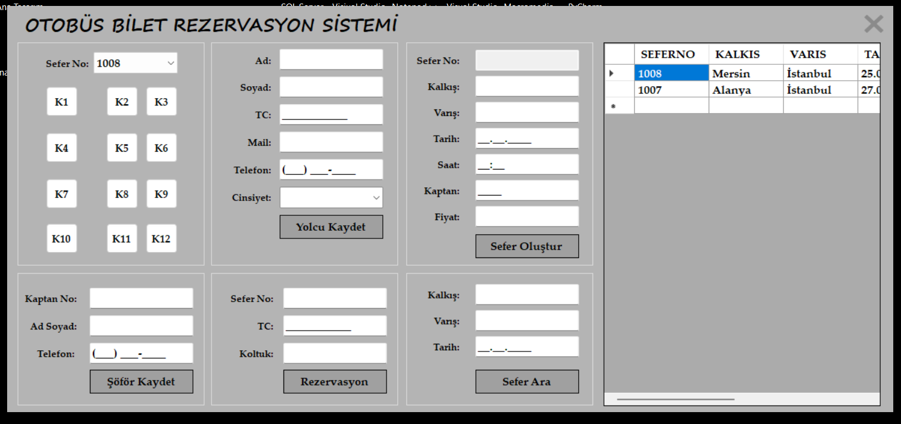

# Yolcu Bilet Rezervasyon & Kayıt Sistemi
## Proje açıklaması
Bu proje yolculara yapılacak bilet satışlarının tutulması için tasarlanmış bir masaüstü uygulamasıdır. Tüm veriler veritabanı içerisinde saklanmaktadır. Proje içerisinde: 
- Yolcu, şöför ve sefer kayıtları eklenebilir.
- Yolculara yapılan bilet satışı bilgisi girilerek veritabanında saklanabilir.
- Mevcut seferler içerisinde kalkış, varış noktaları ve tarih gibi bilgiler girilerek arama yapılabilir.
## Önizleme
**Ana Ekran**

## Kullanılan Teknolojiler
Projede aşağıdaki teknolojiler kullanılmaktadır:

- MSSQL
- C#
- .NET Framework

## Yazarlar
- [Muhammed Mustafa Demirhan](https://github.com/MuhammedMustafaDemirhan) - Projeyi geliştiren
